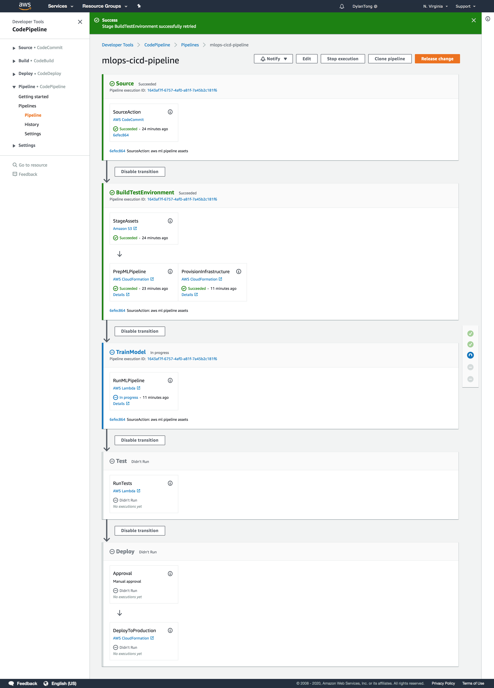

# AWS Serverless: Continuous ML Pipeline
author: [Dylan Tong](mailto:dylatong@amazon.com)

This is a framework for continuous machine learning pipeline automation on AWS. It provides an out-of-the-box integration of AWS serverless components and builds on top of the capabilities provided by services like CodePipeline and the Step Functions Data Science SDK. The framework is designed to be extensible and facilitate a low-code approach to ML pipeline automation.

The solution can be automatically deployed into your account using [CloudFormation](https://aws.amazon.com/cloudformation/). Quick-start instructions are provided below. The solution can be deployed and a working example can be launched with just a few steps.

### What does it do?

The following diagram is the logical archictecture of the solution. 

Operational and pipelining processes vary greatly across projects and organizations by design. The pipeline design provided out-of-the-box is meant to serve as a boiler-plate. This is not a turnkey solution for enterprises.

Some organizations will need to re-design the pipeline to meet their requirements. Enhancements such as multi-account support will be needed in some cases. 

The out-of-the-box pipeline serves as a learning example--it should help a developer understand how to bring AWS's DevOps building blocks together for ML pipeline automation. It also provides a starting point for you to iterate on.

Trek8's Enterprise CI/CD [Quick-start](https://github.com/aws-quickstart/quickstart-trek10-serverless-enterprise-cicd) is a good example of something that is closer to an enterprise turn-key solution. However, the multi-account design makes it harder to deploy. One of the goals of this solution is to enable a working system in your AWS environment with a [few simple steps](#Quick-Start-Instructions).

Many of you will already have an existing CI/CD pipeline, and as described in the following section, you can replace the provided CI/CD backbone. Refer to the advance section below for more details on how to re-design, replace and configure the various components in this solution.

This project is open-source, and is open to contributions that add value to our community. Feel free to contact me if you have a valuable enhancement that you like to contribute to this project.

---

### How does the provided pipeline work?

The provided pipeline consists of five main steps:

---

1. **Change detection:** Changes to assets such as code, configurations and data can trigger the pipeline to run. Triggers include git pushes to the master branch in [CodeCommit](https://aws.amazon.com/codecommit/), or changes to data sets in your S3 bucket.

2. **Build Test and Stage Environment:** The pipeline dynamically builds a test environment as defined by the provided CloudFormation templates. The environment consists of two parts: 

      * The first is a machine learning pipeline built on AWS Step Functions. The purpose of the pipleine is to train, evaluate and deploy ML models. It can be reconfigured through the ML pipeline [template](/cf/mlops-ml-pipeline.yaml) and this [configuration file](/config/ml-pipeline-config.json)

      * The second is the test environment consisting of your application and test suites. The environment can be configured through the following [template](/cf/mlops-test-env.yaml). The provided template deploys a simple microservice consisting of a [AWS Lambda](https://aws.amazon.com/lambda/) function front by [Amazon API Gateway](https://aws.amazon.com/api-gateway/). It communicates with the [Amazon SageMaker](https://aws.amazon.com/sagemaker/) hosted endpoint that is configured in the aforementationed [configuration file](/config/ml-pipeline-config.json). It also deploys a sample test suite that runs on Lambda.
      
3. **Run the ML Pipeline:** The image below illustrates the the Step function workflow of the provided ML pipeline. The pipeline starts with a data prep step executed by [AWS Glue](https://aws.amazon.com/glue/). Next, a customer churn prediction model is trained using XGBoost and this job is tracked as by [SageMaker Experiments](https://aws.amazon.com/sagemaker/) for traceability. The train model is evaluated, and if it meets the performance criteria, the workflow proceeds to deploy the model as a SageMaker [Hosted Endpoint](https://docs.aws.amazon.com/sagemaker/latest/dg/how-it-works-hosting.html). The worfklow completes successfully once the hosted endpoint reaches an in-service status. If the endpoint already exists, a model variant is deployed and the endpoint is updated.

4. **Test Automation:** Once the ML pipeline delivers a healthy model server, we can run our test suites against our model server. The provided [test](tests/) is only meant to serve as an example. It simply invokes the endpoint and reports back the predicton results.

5. **Deploy to Production:** Once the test completes, a manual approval process is required before the changes are deployed into production. Test results can be reported externally or as output variables in CodePipeline. Information gathered in SageMaker Experiments and CloudWatch also facilitate the audit. 

Once the reviewer approves the changes, the pipeline deploys them into production using this [template](cf/mlops-deploy-prod.yaml). The provided template deploys a new copy of the simple microservice. This is optionally deployed into a VPC with a [VPC endpoint](https://docs.aws.amazon.com/sagemaker/latest/dg/interface-vpc-endpoint.html). The API managed by API Gateway is promoted to production using a [carnary deploy](https://docs.aws.amazon.com/apigateway/latest/developerguide/create-canary-deployment.html). Finally, a SageMaker [Model Monitor](https://docs.aws.amazon.com/sagemaker/latest/dg/model-monitor.html) is deployed and is scheduled to evaluate data drift issues on an hourly basis.

### Common Design Patterns

The choosen design isn't the only way to integrate a ML pipeline into an existing CI/CD CodePipeline. Another common pattern is to have AWS Step Functions serve as the overlaying workflow manager and have both CodePipeline and the ML pipelining enclosed within a single Step Function workflow. One might favor this design for better consistency and perhaps a cleaner design.

However, there are trade-offs. The choosen design better decouples the CI/CD pipeline from the ML pipeline. This is ideal for the common case where a CI/CD pipeline already exists and you would like to minimize changes to your core application delivery system. This design augments the existing CI/CD pipeline with Step Function workflow. The integration between the CI/CD pipeline and Step Functions is simply a Lambda function that provides control flow logic. The coupling and dependencies are minimized between the systems. Thus, this integration strategy poses less risks and disruption.

Secondly, at the time of writing, Step Functions is best design to orchestrate systems running exclusively in the AWS cloud. The design pattern prescribed is more flexible. You could replace the CodePipeline backbone in this solution with an on-premise CI/CD solution. The other parts of the pipeline are decoupled and could run in the cloud as part of a hybrid cloud architecture.

### Quick Start Instructions

*Pre-requesites*:
* [An AWS Account](https://aws.amazon.com/free/?all-free-tier.sort-by=item.additionalFields.SortRank&all-free-tier.sort-order=asc)
* [AWS CLI installed](https://aws.amazon.com/cli/)
* [Setup SSH connections for CodeCommit](https://docs.aws.amazon.com/codecommit/latest/userguide/setting-up-ssh-unixes.html)

**Step 1:** Deploy the CodePipeline CI/CD pipeline back-bone

*The launch button defaults to us-west-2, but you can change the region from the console.*

**Step 2:** Wait for template to reach the create complete status.

**Step 3:** Trigger your pipeline to run

If you're running on a Mac OS, you can simply download and run this [shell script](https://raw.githubusercontent.com/dylan-tong-aws/aws-serverless-ml-pipeline/master/bootstrap/quick-start-mac-osx.sh).

If not, git clone this repository and git push all the assets to the CodeCommit repository created in step 1. By default, the CodeCommit repository is called mlops-repo. 

Specifically, the steps are:

1. git clone https://github.com/dylan-tong-aws/aws-serverless-ml-pipeline.git ./tmp
2. git clone ssh://git-codecommit.\<Insert Your Selected AWS Region\>.amazonaws.com/v1/repos/mlops-repo
3. Copy the contents in the "tmp" directory to the "mlops-repo" directory.
4. From within the mlops-repo directory:
     * git add -A
     * git commit -m "aws ml pipeline assets"
     * git push

You can monitor the pipeline progression from the CodePipeline and AWS Step Functions console. Enjoy!

### Advance Concepts

1. **How do I change the configurations such as the algorithm and hyperparameters used by the provided ML pipeline?**

     The provided ML pipeline can be configured through the [ml-pipeline-config.json](/config/ml-pipeline-config.json) file. The configuration file includes configurations to change the algorithm, hyperparameters, endpoint name, experiment tracking, ETL configurations, data source location and more.

2. **How do I modify or replace the workflow structure of the machine learning pipeline?**

     The machine learning pipeline deployment is contained within the [mlops-ml-pipeline.yaml](/cf/mlops-ml-pipeline.yaml) template. There are two main components:
     * The Step Function definition metadata which describes the Step Function workflow for the pipeline. It leverages the [Data Science SDK](https://docs.aws.amazon.com/step-functions/latest/dg/concepts-python-sdk.html), which provides an integration with Amazon SageMaker. The logical resource id for the pipeline is in MLPipeline. You can modify the Step Function definition in that file. Once you commit these changes, the CI/CD backbone will dynamically re-create the new ML pipeline.
     * Control logic is executed through a Lambda function called "ml-pipeline-controller." In some cases, the Data Science SDK isn't sufficient and additional logic has to be implemented. The controller manages more advanced state transitions and serves as an integration point between CodePipeline and Step Functions. You may need to implement additional custom logic to support enhancements to the ML pipeline.

3. **How do I modify the application logic?**

     The provided pipeline deploys a simple microservice. It consists of an API that takes features as input and responds with a prediction. The back-end logic is executed in Lambda and it's sole responsibility is to mediate communication between the SageMaker hosted model and the client. You can enhance the microservice by modifying the [business logic](app/simple-microservice.zip). There're API definitions managed by API Gateway for both test and production environments. These environments are defined in [mlops-test-env.yaml](/cf/mlops-test-env.yaml) and [mlops-deploy-prod.yaml](/cf/mlops-deploy-prod.yaml). 

     AppApiInTest(/cf/mlops-test-env.yaml) and the AppAPIInProd(/cf/mlops-deploy-prod.yaml) are the logical identifiers in these respective templates. The API definitions are defined in swagger 2.0 format.
     
4. **How do I modify and add test suites?**

     The pipeline provides a sample test and it is up to your to extend and implement your own relevant automated tests. The CI/CD pipeline runs a Lambda function called mlops-test-runner(/tests/mlops-test-runner.zip). You should modify this Lambda function so that it serves as a starting point to run your tests. For instance, you might choose to have this Lambda function kick-off a Step Function workflow that orchestrates the execution of your tests. Alternatively, this Lambda function might kick off a series of tests running as containerized workloads in [Fargate](https://aws.amazon.com/fargate/). The design and implementation is left to you.
     
5. **How do I modify my test environment resources?**

     The test environment resources are contained within [mlops-test-env.yaml](/cf/mlops-test-env.yaml). The environment is built dynamically by the CI/CD backbone. You can modify this template as needed.

6. **How do I modify my production environment resources and deployment strategy?**

     The production environment resources are contained within [mlops-prod-deploy.yaml](/cf/mlops-prod-deploy.yaml). The deployment process is executed through a CloudFormation stack update through the CI/CD backbone. You can modify this template as needed. For instance, the canary deploy and production stage settings can be changed through this template.
     
7. **How do I modify the model monitoring functionality?**

     The provided pipeline deploys a SageMaker default monitor. You can create a [custom monitor](https://docs.aws.amazon.com/sagemaker/latest/dg/model-monitor-custom-monitoring-schedules.html) and modify the monitor image resource used by the MonitoringSchedule resource defined in [mlops-prod-deploy.yaml](/cf/mlops-prod-deploy.yaml).

8. **How do I modify or replace the CodePipeline CI/CD backbone?**

     The [CI/CD Pipeline](/cf/mlops-cicd.yaml) backbone is defined in this [template](/cf/mlops-cicd.yaml). You can modify the CodePipeline stages by modifying the proprities defined for the resource, CICDPipeline. 
     
     If you want to replace CodePipeline as the CI/CD backbone, you could integrate your alternative CI/CD solution using the same or similar strategy employed in this example. Ultimately, your solution needs to be able to make API calls to AWS Lambda and CloudFormation to orchestrate the other parts of this pipeline. The provided assets and design could be re-used and serve as a reference.
     

### Known Issues

1. *[6/2/2020]* **Network communication between Lambda and SageMaker VPC interface endpoint**

     The provided template includes VPC support. However, at the time of writing, there is a network issue between AWS Lambda and the VPC interface endpoint that prevents communication between a Lambda function running in a VPC and a SageMaker hosted endpoint through a VPC interface endpoint. Consequently, communication between Lambda and the hosted endpoint needs to be public until this issue is fixed.
